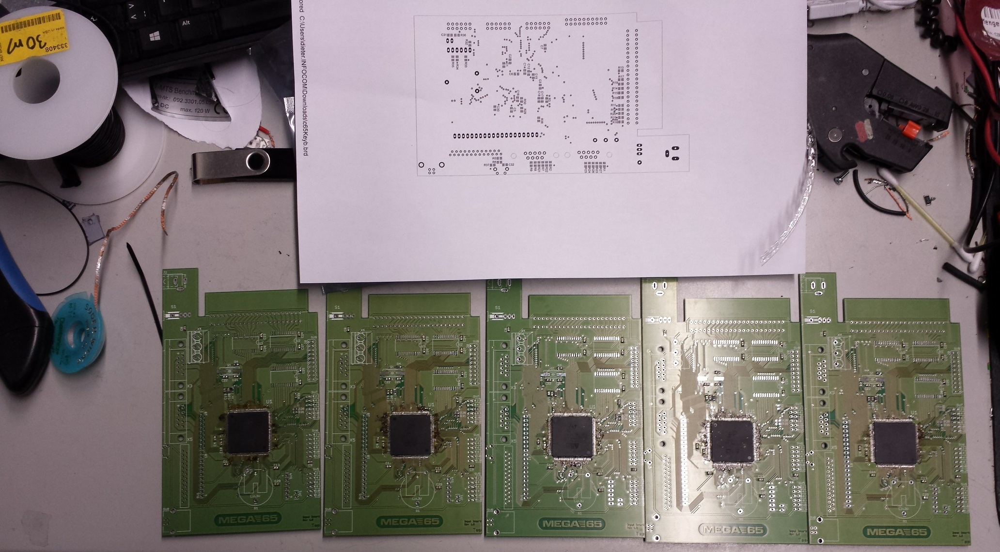

# Firmware for the DM65PIC
## MEGA65 Computer


MEGA65 is an open-source new and open C65-like computer.
All hardware designs and all software are open-source (LGPL).
Please visit www.mega65.org to learn more about it.

## DM65PIC Peripheral Interface Controller
The DM65PIC is the peripheral interface controller for the MEGA65 computer.
It is based on the STM32 F4 microcontroller. Here is a picture of some
prototype version of our custom PCB:



This GitHub repository is containing the firmware of the DM65PIC.

You can see a combination of a MEGA65 FPGA prototype (based on a Nexys 4 DDR
board), a DMPIC65 prototype and a very first work-in-progress version of the
firmware in conjuncton with a real Commodore 65 prototype keyboard in action
on YouTube: [https://youtu.be/5PpsEw80j3M](https://youtu.be/5PpsEw80j3M).

### Folder structure
```
00-STM32F4xx_STANDARD_PERIPHERAL_DRIVERS  STM32 CMSIS and standard drivers
00-STM32F429_LIBRARIES                    Tilen Majerle's STM32F4 library
01-DM65PIC                                The actual firmware for the DM65PIC
eagle                                     Hardware design for the PCB
```

### How to build
We used the free version of [Keil uVision5](http://www.keil.com/uvision/).
The free version is code-size constrained (32KB), but as our compiled firmware
(including all the libs) is smaller then 32KB, the free version works fine.

After having installed the Keil IDE, just double click or open the file
`project.uvprojx` in the `01-DM65PIC` folder. As all paths are relative, you
should be able to build without further modifications.

### Credits
* [Paul Gardner-Stephen](http://c65gs.blogspot.de): MEGA65 main developer
* [Deft](http://www.m-e-g-a.org/de/mega/profile): chief MEGA65 officer
* doubleflash: DM65PIC hardware design
* [sy2002](http://www.sy2002.de): DM65PIC firmware

Special thanks go to Tilen Majerle for supporting sy2002 in learning how to
work with the STM32 toolchain and of course for creating the awesome
[STM32F4 library](http://stm32f4-discovery.com) that we heavily used for
creating the DM65PIC firmware.
